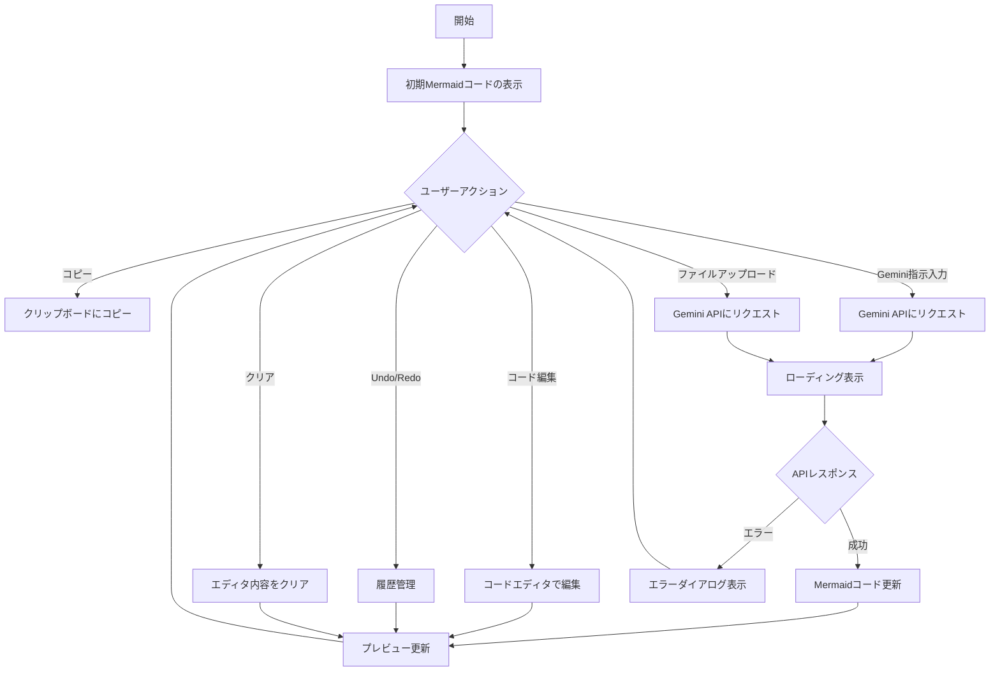

# Mermaid Editor GenAI

Mermaid Editor GenAIは、Mermaidダイアグラムを生成および編集するためのWebアプリケーションです。Google Generative AI（Gemini）を使用して、指示に基づいてMermaidコードを自動的に更新します。

## 機能

- **コードエディタ**：Mermaidコードを直接編集できます。
- **履歴機能**：UndoおよびRedoボタンで変更履歴を管理します。
- **クリア機能**：エディタの内容をクリアします。
- **コピー機能**：エディタの内容をクリップボードにコピーします。
- **自動更新機能**：指示を入力するとGoogle Generative AIを使用してMermaidコードを更新します。
- **プレビュー機能**：Mermaidコードのプレビューをリアルタイムで表示します。

## 使用技術

- Next.js
- React
- TypeScript
- Tailwind CSS
- CodeMirror
- Google Generative AI (Gemini)

## 環境構築

### 依存関係のインストール

```bash
npm install
```

### 環境変数の設定

`NEXT_PUBLIC_GEMINI_API_KEY` を設定する必要があります。以下のように`.env.local`ファイルを作成して設定します。

```plaintext
NEXT_PUBLIC_GEMINI_API_KEY=YOUR_API_KEY
```

### 開発サーバーの起動

```bash
npm run dev
```

ブラウザで `http://localhost:3000` にアクセスしてください。

### ビルド

```bash
npm run build
```

### プロダクションモードでの起動

```bash
npm start
```

## プロジェクト構成

- `components/CodeEditor.tsx`：Mermaidコードを編集するためのエディタコンポーネント。
- `components/ErrorDialog.tsx`：エラーダイアログコンポーネント。
- `components/GeminiInput.tsx`：Google Generative AIに指示を送るための入力コンポーネント。
- `components/LoadingDialog.tsx`：ローディングダイアログコンポーネント。
- `components/MermaidPreview.tsx`：Mermaidコードのプレビューコンポーネント。
- `pages/_app.tsx`：アプリケーションのメインエントリーポイント。
- `pages/index.tsx`：ホームページ。
- `utils/geminiApi.ts`：Google Generative AI APIとの通信を行うユーティリティ。

## 処理の流れ

以下は、Mermaid Editor GenAIの主な処理の流れを示すフローチャートです。



## ライセンス

このプロジェクトはMITライセンスのもとで公開されています。詳細は`LICENSE`ファイルを参照してください。
